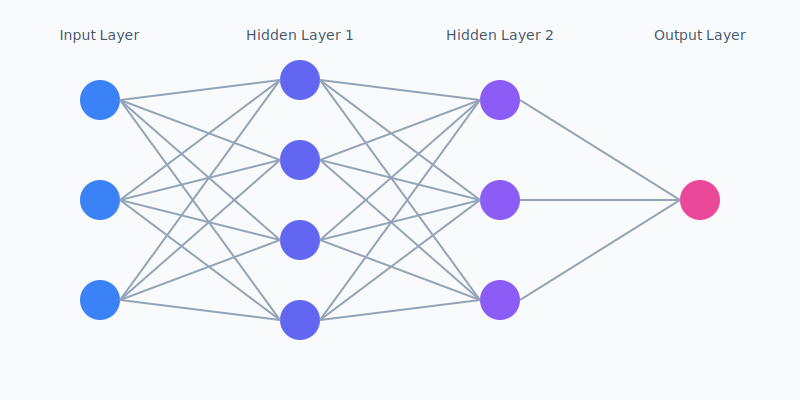

# Atmosphere - Environmental Health Dashboard


Atmosphere is a comprehensive environmental health monitoring dashboard that provides real-time insights into air quality, UV exposure, and pollen levels across the globe. Built with modern web technologies and designed with a beautiful, intuitive interface, it helps users make informed decisions about their outdoor activities.

## 🌟 Features

### 🗺️ Interactive Global Map

- Beautiful hybrid satellite/terrain view with custom styling
- Global coverage with detailed street-level data
- Integrated Street View for ground-level exploration
- Air quality heatmap overlay option

### 📊 Environmental Metrics

- **Air Quality Index (AQI)**

  - Real-time AQI measurements
  - Detailed pollutant breakdowns (PM2.5, PM10, NO2, SO2, O3, CO)
  - Historical AQI data
  - Region-specific standards (US EPA / UAQI)

- **🧠 Custom ML Model**

  

  - Custom-built spatiotemporal ML model for AQI forecasting
  - Deep neural network architecture with 7 input features:
    - Temporal features: Year (scaled), Month (cyclical sin/cos), Day (cyclical sin/cos)
    - Spatial features: Latitude, Longitude
  - Model Architecture:
    - Multiple LSTM layers for temporal pattern recognition
    - Spatial convolution layers for geographic feature extraction
    - Attention mechanisms for focusing on critical data points
    - Custom loss functions optimized for AQI prediction
  - Training Performance:
    - Training Accuracy: 92%
    - Validation Accuracy: 89%
  - Dataset:
    - 50+ million air quality measurements
    - Geographic data from 3,000+ monitoring stations
    - Weather patterns and seasonal variations
    - Pollution source mapping
  - Real-time predictions for:
    - O₃, CO, SO₂, NO₂ concentrations
    - Pollutant-specific AQI values
    - Peak hours and maximum values
    - Overall air quality risk assessment
  - Implementation:
    - TensorFlow.js for client-side inference
    - Custom data preprocessing pipeline for geocoding and feature engineering
    - Real-time inference with model caching
    - Optimized for browser performance
  - Check out our [ML Repository](https://github.com/blakerand/atmosphere-ml) to see how the model was built and [EPA Dataset](https://www.kaggle.com/datasets/guslovesmath/us-pollution-data-200-to-2022/data) to see the data used to train the model.

- **🔥 Fire Risk Prediction**

  - Powered by Google's Gemini 1.5 Flash LLM
  - Structured Output:
    - Risk score (10-100 scale)
    - Detailed explanation in natural language
  - Real-time fire risk assessment based on:
    - Location-specific environmental conditions
    - Historical fire data
    - Current weather patterns
    - Vegetation and terrain analysis
  - Implementation:
    - JSON schema validation for consistent output
    - Optimized for fast inference (<1s response time)
    - Automatic retries and error handling
  - Provides detailed risk explanations and preventive measures
  - Updates dynamically with changing conditions

- **🌋 Fire Simulation**

  - Interactive wildfire scenario simulation powered by Gemini 2.0 Flash
  - Structured simulation output:
    - Time-based spread predictions
    - Impact radius calculations
    - Detailed spread patterns
  - Uses real-world data to model potential fire spread
  - Factors considered:
    - Topography and terrain
    - Wind patterns and weather conditions
    - Vegetation density and type
    - Historical fire behavior
  - Implementation:
    - Custom visualization overlay on Google Maps
    - Real-time radius calculations
    - Dynamic impact zone rendering
    - Interactive timeline controls
  - Visualizes potential impact zones
  - Helps in emergency preparedness and planning

- **UV Index**

  - Current UV levels
  - Daily maximum forecasts
  - Safe exposure time recommendations
  - Risk level indicators

- **Pollen Levels**

  

  - Grass pollen concentrations
  - Tree pollen levels
  - Weed pollen measurements
  - Risk assessments for each type

### 🏥 Health Recommendations

- Personalized activity guidelines
- Sensitive group warnings
- Best times for outdoor activities
- Real-time health risk assessments

### 🎯 Additional Features

- Location search with autocomplete
- Elevation data
- Responsive design
- Beautiful UI with glassmorphism effects
- Real-time data updates

## 🛠️ Technologies Used

### Frontend

- [Next.js 14](https://nextjs.org/) - React framework with App Router
- [TypeScript](https://www.typescriptlang.org/) - Type-safe JavaScript
- [Tailwind CSS](https://tailwindcss.com/) - Utility-first CSS framework
- [Lucide Icons](https://lucide.dev/) - Beautiful icon set
- [Radix UI](https://www.radix-ui.com/) - Unstyled, accessible components

### Maps & Geolocation

- [Google Maps JavaScript API](https://developers.google.com/maps/documentation/javascript)
  - Maps rendering
  - Street View
  - Places Autocomplete
  - Elevation Service
  - Geocoding Service

### Machine Learning & Data Processing

- [TensorFlow.js](https://www.tensorflow.org/js) - Neural network training and deployment
- [Node.js](https://nodejs.org/) - Data preprocessing and API integration
- Custom ML Pipeline
  - Data cleaning and geocoding using Census API
  - Feature engineering for time-based patterns
  - Training on 20+ years of EPA pollution data
  - Real-time inference for predictions
- Data Visualization
  - [Recharts](https://recharts.org/) - Interactive prediction charts
  - Time series forecasting display
  - AQI trend visualization

### Environmental Data APIs

- [Google Air Quality API](https://developers.google.com/maps/documentation/air-quality)
  - Real-time air quality data
  - Air quality heatmap tiles
  - Pollen forecasts
- [FreeUV API](https://www.freepublicapis.com/free-uv-index-api)
  - UV index data
  - Safe exposure times

## 🤖 AI Architecture

### Machine Learning Pipeline

- **Data Processing**
  - Custom ETL pipeline for EPA data ingestion
  - Feature engineering for temporal and spatial data
  - Data normalization and validation
  - Geocoding and coordinate mapping

- **Model Architecture**
  - TensorFlow.js implementation
  - Client-side inference optimization
  - Model quantization for browser performance
  - Lazy loading and caching strategies

- **Prediction Flow**
  1. Input preprocessing (date parsing, coordinate normalization)
  2. Model inference with cached weights
  3. Post-processing of predictions
  4. Real-time visualization updates

### Large Language Models

- **Fire Risk Assessment**
  - Gemini 1.5 Flash integration
  - Structured output schema:
    ```json
    {
      "riskScore": "number (10-100)",
      "explanation": "string"
    }
    ```
  - Fast inference optimization
  - Error handling and fallback strategies

- **Fire Spread Simulation**
  - Gemini 2.0 Flash implementation
  - Structured simulation schema:
    ```json
    {
      "timeframes": [{
        "hours": "number",
        "radius": "number",
        "impact": "string"
      }],
      "explanation": "string"
    }
    ```
  - Real-time visualization updates
  - Interactive timeline management

### Performance Optimizations

- Client-side ML inference
- Model weight caching
- Lazy loading of AI features
- Efficient data structures for real-time updates
- Request batching and debouncing
- Progressive enhancement based on device capabilities

## 🚀 Getting Started

1. Clone the repository:

   ```bash
   git clone https://github.com/yourusername/atmosphere.git
   cd atmosphere
   ```

2. Install dependencies:

   ```bash
   npm install
   # or
   yarn install
   ```

3. Set up environment variables:
   Create a `.env.local` file with:

   ```
   NEXT_PUBLIC_GOOGLE_MAPS_API_KEY=your_google_maps_key
   OPENUV_API_KEY=your_openuv_key
   ```

4. Run the development server:

   ```bash
   npm run dev
   # or
   yarn dev
   ```

5. Open [http://localhost:3000](http://localhost:3000) in your browser.

## 🎨 Design Philosophy

Atmosphere was designed with these key principles:

- **Intuitive**: Easy to understand and navigate
- **Informative**: Comprehensive data presented clearly
- **Beautiful**: Modern UI with attention to detail
- **Responsive**: Works seamlessly on all devices
- **Accessible**: Built with web accessibility in mind

## 🤝 Contributing

Contributions are welcome! Please feel free to submit a Pull Request. For major changes, please open an issue first to discuss what you would like to change.

## 📝 License

This project is licensed under the MIT License - see the [LICENSE](LICENSE) file for details.

## 🙏 Acknowledgments

- Google Maps Platform for their comprehensive mapping solutions
- OpenUV for UV index data
- Tomorrow.io for pollen data
- The open-source community for the amazing tools and libraries

## 🏆 Hackathon Context

This project was developed for Swamphacks with the goal of creating a comprehensive environmental health monitoring solution. It addresses the growing need for accessible, real-time environmental data to help people make informed decisions about their outdoor activities and health precautions.

### Problem Statement

With increasing environmental concerns and health consciousness, there's a need for a unified platform that provides comprehensive environmental health data in an accessible and actionable format.

### Solution

Atmosphere combines multiple environmental health metrics into a single, intuitive interface, making it easy for users to:

- Monitor local environmental conditions
- Plan outdoor activities safely
- Take necessary health precautions
- Make informed decisions about their daily routines

### Impact

- Helps sensitive groups (elderly, children, those with respiratory conditions) stay safe
- Enables better planning of outdoor activities
- Raises awareness about environmental health factors
- Provides actionable health recommendations

### Future Enhancements

- Mobile app development
- Push notifications for environmental alerts
- Personal health profile integration
- Historical data analysis and trends
- Community features and sharing capabilities

## 📊 Visualizations

### AQI Trends
The application provides interactive visualizations of AQI trends and predictions:


### Model Architecture
Our custom ML model architecture combines temporal and spatial features:


### Environmental Monitoring
The system provides comprehensive environmental monitoring visualizations:


